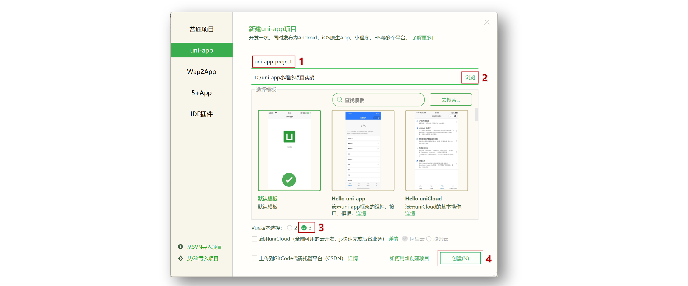
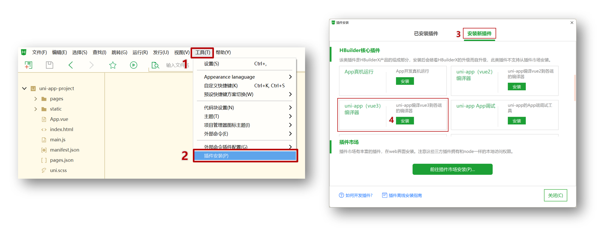
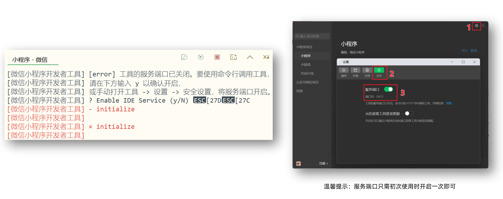
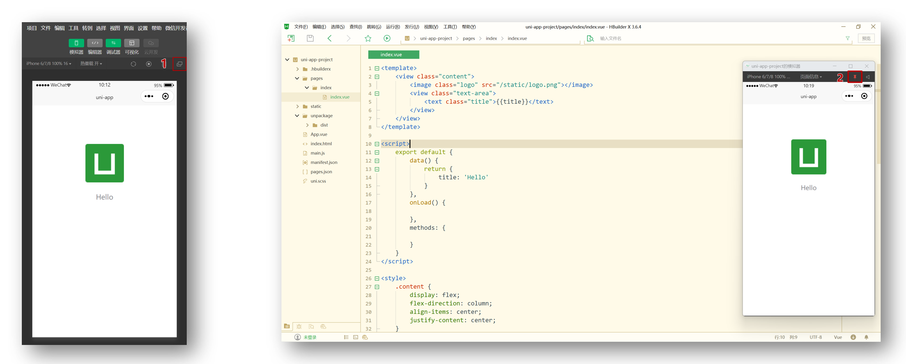
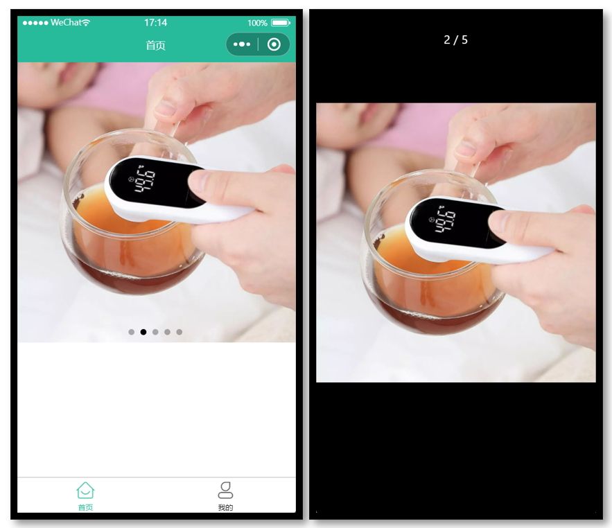

# uni-app 基础

## 创建 uni-app 项目方式

**uni-app 支持两种方式创建项目：**

1. 通过 HBuilderX 创建

2. 通过命令行创建（推荐）

## HBuilderX 创建 uni-app 项目

### 创建步骤

**1.下载安装 HbuilderX 编辑器**


**2.通过 HbuilderX 创建 uni-app vue3 项目**



**3.安装 uni-app vue3 编译器插件**



**4.编译成微信小程序端代码**


**5.开启服务端口**



**小技巧分享：模拟器窗口分离和置顶**



**Hbuildex 和 微信开发者工具 关系**


温馨提示：**Hbuildex** 和 **uni-app** 都属于 [DCloud](https://dcloud.io) 公司的产品。

## pages.json 和 tabBar 案例

### 目录结构

我们先来认识 uni-app 项目的目录结构。

```shell
├─pages            业务页面文件存放的目录
│  └─index
│     └─index.vue  index页面
├─static           存放应用引用的本地静态资源的目录(注意：静态资源只能存放于此)
├─unpackage        非工程代码，一般存放运行或发行的编译结果
├─index.html       H5端页面
├─main.js          Vue初始化入口文件
├─App.vue          配置App全局样式、监听应用生命周期
├─pages.json       **配置页面路由、导航栏、tabBar等页面类信息**
├─manifest.json    **配置appid**、应用名称、logo、版本等打包信息
└─uni.scss         uni-app内置的常用样式变量
```

### 解读 pages.json

用于配置页面路由、导航栏、tabBar 等页面类信息

pages：页面路由及窗口表现

globalstyle：默认窗口表现，全局修改

tabBar：至少两个才显示

### 案例练习

**效果预览**


**参考代码**

```json
{
  // 页面路由
  "pages": [
    {
      "path": "pages/index/index",
      // 页面样式配置   // 导航栏
      "style": {
        "navigationBarTitleText": "首页"
      }
    },
    {
      "path": "pages/my/my",
      "style": {
        "navigationBarTitleText": "我的"
      }
    }
  ],
  // 全局样式配置
  "globalStyle": {
    "navigationBarTextStyle": "white",
    "navigationBarTitleText": "uni-app",
    "navigationBarBackgroundColor": "#27BA9B",
    "backgroundColor": "#F8F8F8"
  },
  // tabBar 配置  tabBar--list 至少要配置两项才会生效
  "tabBar": {
    "selectedColor": "#27BA9B",  // tabBar选中时的文字颜色
    "list": [
      {
        "pagePath": "pages/index/index",
        "text": "首页",
        "iconPath": "static/tabs/home_default.png",  // 图标
        "selectedIconPath": "static/tabs/home_selected.png"   // 高亮图标
      },
      {
        "pagePath": "pages/my/my",
        "text": "我的",
        "iconPath": "static/tabs/user_default.png",
        "selectedIconPath": "static/tabs/user_selected.png"
      }
    ]
  }
}
```

## uni-app 和原生小程序开发区别

### 主要区别

uni-app 项目每个页面是一个 `.vue` 文件，数据绑定及事件处理同 `Vue.js` 规范：

1. 属性绑定 `src="{{ url }}"` 升级成 `:src="url"`

2. 事件绑定 `bindtap="eventName"` 升级成 `@tap="eventName"`，**支持（）传参**

3. 支持 Vue 常用**指令** `v-for`、`v-if`、`v-show`、`v-model` 等

### 其他区别补充

1. 调用接口能力，**建议**前缀 `wx` 替换为 `uni` ，养成好习惯，这样支持多端开发。
2. `<style></style>` 样式不需要写 `scoped`
3. 生命周期分为三部分：应用生命周期(小程序)，页面生命周期(小程序)，组件生命周期(Vue)

### 案例练习

**效果预览**


**主要功能**

1.  滑动轮播图
2.  点击大图预览

**参考代码 **  pages\index\index.vue

```vue
<template>
  // indicator-dots 轮播图指示点属性  circular 无缝轮播  autoplay 自动轮播
  // :autoplay="false"数据绑定  没有:则解析成字符串
  <swiper class="banner" indicator-dots circular :autoplay="false">
    <swiper-item v-for="item in pictures" :key="item.id">
      // @tap 绑定一个点击事件  可以通过()进行传参
      // @ 事件绑定     : 属性绑定
      <image @tap="onPreviewImage(item.url)" :src="item.url"></image>
    </swiper-item>
  </swiper>
</template>

<script>
export default {
  data() {
    return {
      // 轮播图数据
      pictures: [
        {
          id: '1',
          url: 'https://pcapi-xiaotuxian-front-devtest.itheima.net/miniapp/uploads/goods_preview_1.jpg',
        },
        {
          id: '2',
          url: 'https://pcapi-xiaotuxian-front-devtest.itheima.net/miniapp/uploads/goods_preview_2.jpg',
        },
        {
          id: '3',
          url: 'https://pcapi-xiaotuxian-front-devtest.itheima.net/miniapp/uploads/goods_preview_3.jpg',
        },
        {
          id: '4',
          url: 'https://pcapi-xiaotuxian-front-devtest.itheima.net/miniapp/uploads/goods_preview_4.jpg',
        },
        {
          id: '5',
          url: 'https://pcapi-xiaotuxian-front-devtest.itheima.net/miniapp/uploads/goods_preview_5.jpg',
        },
      ],
    }
  },
  methods: {
    onPreviewImage(url) {
      // 大图预览
      // map()方法遍历数组，返回处理后的新数组
      // map() 方法返回一个新数组，数组中的元素为原始数组元素调用函数处理后的值。
      // map() 方法按照原始数组元素顺序依次处理元素。
      // 注意： map() 不会对空数组进行检测。
      // 注意： map() 不会改变原始数组。
      // 也就是对一个数组进行一定的处理并返回处理的结果。
      // 写不写return 都会返回一个数组，需要一个值来接收这个数组。
      // 某种程度上和foreach差不多，但是foreach不会返回。
      uni.previewImage({         // 预览图片api
        urls: this.pictures.map((v) => v.url),   // 需要预览的图片链接
        current: url,
      })
    },
  },
}
</script>

<style>
# 设置轮播图以及图片的宽高
# rpx： 是微信小程序独有的，解决屏幕自适应的尺寸单位
# 可以根据屏幕宽度进行自适应，不论屏幕大小，规定屏幕宽为 750rpx，
# 通过rpx设置元素和字体大小，小程序在不同尺寸的屏幕上可以自适应适配
.banner,
.banner image {
  width: 750rpx;
  height: 750rpx;
}
</style>
```

## 命令行创建 uni-app 项目

**优势**

通过命令行创建 uni-app 项目，**不必依赖 HBuilderX**，TypeScript 类型支持友好。

**命令行创建** **uni-app** **项目：**

vue3 + ts 版

```shell
# npx degit dcloudio/uni-preset-vue#vite-ts 项目名称
npx degit dcloudio/uni-preset-vue#vite-ts uni-app-vue3-ts
# npx是npm5.2新增的软件包管理工具，与npm绑在一起
# 使用npx好处,使用 npx 去执行包时，会保证使用的是最新的构建工具，无需担心包版本升级的问题
# npx <package> <command>
# package 表示你想要使用的npm包
# degit是一个npm包，它的功能类似于git clone，可以帮助我们执行代码clone操作。
# #vite-ts 代表分支

# 创建以 javascript 开发的工程  
npx degit dcloudio/uni-preset-vue#vite my-vue3-project  

# 创建以 typescript 开发的工程  
npx degit dcloudio/uni-preset-vue#vite-ts my-vue3-project 
```

创建其他版本可查看：[uni-app 官网](https://uniapp.dcloud.net.cn/quickstart-cli.html)

### 编译和运行 uni-app 项目

1. 安装依赖 `pnpm install`
2. 编译成微信小程序 `pnpm dev:mp-weixin`
3. 导入微信开发者工具     导入 > dist > dev > mp-weixin

温馨提示: 在 `manifest.json` 文件添加小程序 `appid` 方便真机预览

#### 补充：启动uniapp+vue3+ts项目

~~~bash
1.安装依赖  在根目录下
	npm i 或 yarn
2.运行项目
	# 运行到 h5   
	npm run dev:h5  
	# 运行到 app   
	npm run dev:app  
	# 运行到 微信小程序  
	npm run dev:mp-weixin
	# 微信小程序演示与调试：执行命令后，在微信开发者工具将./dist/dev/mp-weixin文件夹引入就行
3.打包
	# 打包到 h5   
	npm run build:h5  
	# 打包到 app   
	npm run build:app  
	# 打包到 微信小程序  
	npm run build:mp-weixin
~~~


## 用 VS Code 开发 uni-app 项目

### 为什么选择 VS Code？

- VS Code 对 **TS 类型支持友好**，前端开发者**熟悉的编辑器** 👍
- HbuilderX 对 TS 类型支持暂不完善，期待官方完善 👀

### 用 VS Code 开发配置

- 安装 uni-app 插件
  - **uni-create-view** ：快速创建 uni-app 页面
  - **uni-helper **：uni-app代码提示
  - **uniapp 小程序扩展** ：鼠标悬停查文档
- TS 类型校验
  - 安装类型声明文件 `pnpm i -D @types/wechat-miniprogram @uni-helper/uni-app-types`
  - 配置 `tsconfig.json`
- JSON 注释问题
  - 设置文件关联，把 `manifest.json` 和 `pages.json` 设置为 `jsonc`
  - uniapp中只允许`manifest.json` 和 `pages.json`两个json文件写注释

```diff
// tsconfig.json
{
  "extends": "@vue/tsconfig/tsconfig.json",
  "compilerOptions": {
    "sourceMap": true,
    "baseUrl": ".",
    "paths": {
      "@/*": ["./src/*"]
    },
    "lib": ["esnext", "dom"],
    "types": [
      "@dcloudio/types",
+      "@types/wechat-miniprogram",
+      "@uni-helper/uni-app-types"
    ]
  },
  "include": ["src/**/*.ts", "src/**/*.d.ts", "src/**/*.tsx", "src/**/*.vue"]
}
```

**注意：原配置 `experimentalRuntimeMode` 现无需添加。**

## 开发工具回顾

选择自己习惯的编辑器开发 uni-app 项目即可。

**VS Code 和 微信开发者工具 关系**


**HbuilderX 和 微信开发者工具 关系**


## 用 VS Code 开发课后练习

使用 `VS Code` 编辑器写代码，实现 tabBar 案例 + 轮播图案例。

**温馨提示：`VS Code` 可通过快捷键 `Ctrl + i` 唤起代码提示。**
